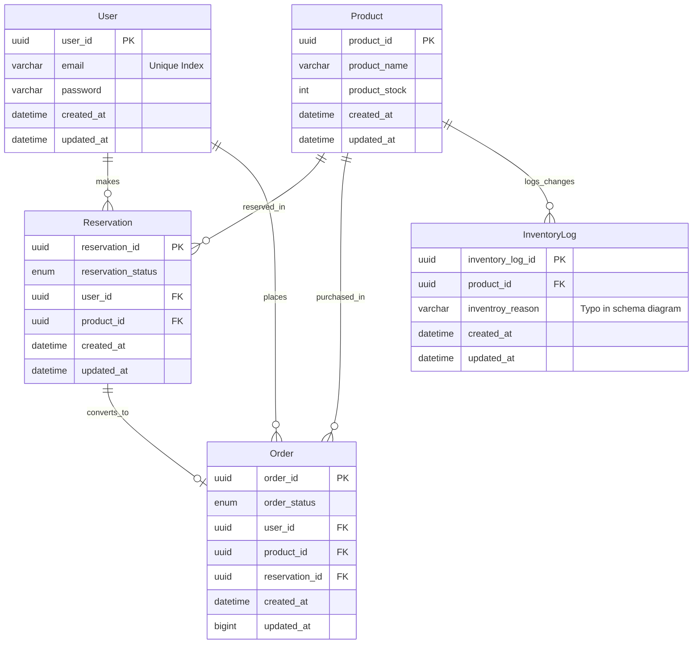

# Limited Stock Product Drop System

TypeScript API for a limited-inventory product drop platform. Handles user accounts, product stock, reservations, orders, and inventory audit logs.

## Getting Started

```bash
npm install
npm run dev
```

The API runs on `http://localhost:3001` by default. Health check: `GET /health`.

---

## Database Architecture

This system uses a highly structured relational database schema designed to support high-concurrency limited-stock drops. Below is the Entity-Relationship Diagram (ERD) and detailed documentation of the schema.

### Entity-Relationship Diagram (ERD)



---

### Data Dictionary & Schema Specification

#### 1. `User`
Stores credential and identification records for platform participants.
- `user_id` (UUID, Primary Key): Uniquely identifies a user.
- `email` (VARCHAR, Unique Index): User email used for authentication.
- `password` (VARCHAR): Hashed credential storage.
- `created_at` (DATETIME): Timestamp of record creation.
- `updated_at` (DATETIME): Timestamp of last modification.

#### 2. `Product`
Stores details of merchandise being offered in drops.
- `product_id` (UUID, Primary Key): Uniquely identifies a product.
- `product_name` (VARCHAR): The displayed title of the item.
- `product_stock` (INT): Current stock quantity remaining.
- `created_at` (DATETIME): Timestamp of record creation.
- `updated_at` (DATETIME): Timestamp of last modification.

#### 3. `Reservation`
Holds a temporary virtual lock on stock when a drop begins.
- `reservation_id` (UUID, Primary Key): Uniquely identifies a reservation lock.
- `reservation_status` (ENUM): e.g., `PENDING`, `COMPLETED`, `EXPIRED`, `CANCELLED`.
- `user_id` (UUID, Foreign Key): References `User.user_id`.
- `product_id` (UUID, Foreign Key): References `Product.product_id`.
- `created_at` (DATETIME): Timestamp of lock reservation (crucial for timeout checks).
- `updated_at` (DATETIME): Timestamp of status transition.

#### 4. `Order`
Represents finalized purchases.
- `order_id` (UUID, Primary Key): Uniquely identifies a purchase order.
- `order_status` (ENUM): e.g., `PENDING`, `PAID`, `FAILED`, `REFUNDED`.
- `user_id` (UUID, Foreign Key): References `User.user_id`.
- `product_id` (UUID, Foreign Key): References `Product.product_id`.
- `reservation_id` (UUID, Foreign Key): References `Reservation.reservation_id`.
- `created_at` (DATETIME): Timestamp of transaction placement.
- `updated_at` (BIGINT): Unix epoch timestamp of modification (optimized for rapid synchronization).

#### 5. `InventoryLog`
Audit ledger for tracking all changes to product stock.
- `inventory_log_id` (UUID, Primary Key): Uniquely identifies a log entry.
- `product_id` (UUID, Foreign Key): References `Product.product_id`.
- `inventroy_reason` (VARCHAR): Description/reason for the adjustment (e.g., 'Restock', 'Reservation Release'). *Note: Column contains a visual typo `inventroy_reason` in the DrawSQL schema definition.*
- `created_at` (DATETIME): Timestamp of the audit event.
- `updated_at` (DATETIME): Timestamp of last log updates.

---

### Why the Associations Exist (Rationale)

A limited-stock product drop system must handle high concurrency and prevent race conditions (such as double-purchases or overselling beyond the available `product_stock`). The associations between these tables are strategically structured to enforce transactional integrity:

#### A. The Reservation-Centric Flow
Instead of allowing users to directly create an `Order` from a `Product` (which can cause checkout race conditions), the system utilizes a two-phase commit-like pattern via the `Reservation` table.
1. **Product ↔ Reservation**: When a user clicks "Buy", they request a `Reservation`. This associates the **Product** to the **Reservation** and temporarily decrements the virtual stock.
2. **User ↔ Reservation**: Establishes identity ownership. We know exactly which **User** has claimed the lock, allowing us to enforce rate-limiting rules (e.g., one reservation per user).
3. **Reservation ↔ Order (Zero-to-One)**: Once the user successfully pays before the reservation times out, an **Order** is generated referencing the **Reservation**. If the transaction fails or times out, the reservation expires, the stock is returned, and no order is finalized. Linking `reservation_id` as a foreign key on the `Order` table ensures that **every order is backed by a valid, pre-secured stock lock**.

#### B. Direct Order Associations (`user_id` & `product_id` redundancy)
The `Order` table explicitly maintains direct foreign keys to `user_id` and `product_id`, even though they could theoretically be retrieved transitively through the `Reservation` table. This denormalization is intentional:
* **Query Performance**: Minimizes expensive multi-table joins when querying user purchase histories or product sales statistics under high load.
* **Archival Durability**: If historical reservations are purged or cleaned up to save space, the core purchase relationships between **Users**, **Products**, and **Orders** remain intact.

#### C. The Audit Ledger (`Product` ↔ `InventoryLog`)
Stock drop platforms must be highly auditable. A direct relation exists from `Product` to `InventoryLog`. 
* Whenever stock is reserved, restocked, or adjusted due to a canceled payment, a log entry is created. 
* This one-to-many relationship provides a complete physical trace of every single stock adjustment, which is critical for identifying synchronization bugs, drift, or malicious attempts to exploit checkout flows.
